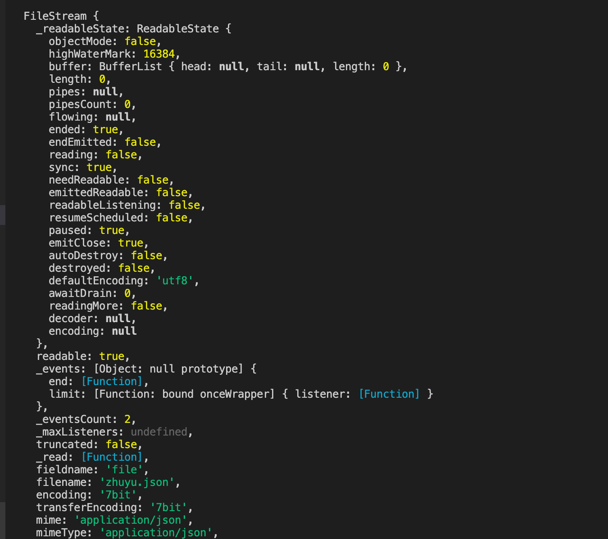
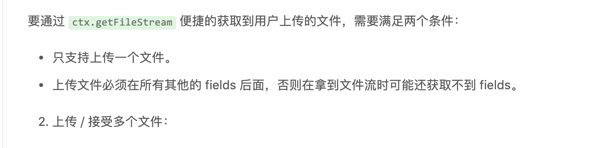

# 启动命令
```bash
$ npm i
$ npm run dev
$ open http://localhost:7001/
```

### 部署命令

```bash
$ npm start
$ npm stop
```
### 插件
`markdown-preview-enhanced`在vscode中markdown
#易错问题解决
1. csrf解决（在使用post请求接口的时候会报错）
解决： 在config配置项里面config.default.js里面添加
```
config.security = {
  csrf: {
    enable: false,
  },
};
```
2. 配置连接mysql
* 在config.default.js里面配置内容
```
//配置mysql
config.mysql = {
  client: {
      // host
      host: 'localhost',
      // 端口号
      port: '3306',
      // 用户名
      user: 'root',
      // 密码
      password: '128038zy',
      // 数据库名
      database: 'Test',
  },
  // 是否加载到 app 上，默认开启
  app: true,
  // 是否加载到 agent 上，默认关闭
  agent: false,
}
```
* 在plugin.js里面打开指定插件
```
exports.mysql = {
  enable: true,// 开启
  package: 'egg-mysql', // 对应哪个包
};
```
3. 修改端口
在config.default.js里面加入配置config的文件
```
config.cluster = {
      listen: {
        path: '',
        port: 8000,
        hostname: '0.0.0.0',
      }
  };
```
4. 配置允许file和stream的模式（在config.default.js中配置）
```
//配置支持file模式
exports.multipart = {
  mode: 'file',
  fileExtensions:[".xlsx",".xls",".dmg"]//配置扩展名白名单
};
```
5.注意文件和流的概念
文件只能一块一块的上传，而流的形式可以指定每次上传多大的形式，更加具有性能优势
6. 服务端获得的fileStream里面有很多内容

7. 配置单文件流和多文件流
  ```
  //配置流的方式，先了解一下文件同步，异步和流的基本操作
  const fs=require("fs");
//使用文件的形式
//同步读取文件
const fileSync=fs.readFileSync("./package-lock.json",{encoding:"utf8"});//不设置编码的情况下返回buffer

//同步写文件
const writeFile=fs.writeFileSync("./zhuyu2.json",fileSync);//返回undefined

//异步读取文件
fs.readFile("./package.json",{encoding:"utf-8"},(err,data)=>{
    if(err) throw err;
    //异步写文件
    fs.writeFile("./zhuyu3.json",{encoding:"utf-8"},err=>{
        if (err) throw err
        console.log("文件写入成功")
    })
});

//使用流的形式

//创建读取流
const readStream=fs.createReadStream("./package.json");
console.log(readStream);
//创建写入流
const writeStream=fs.createWriteStream("./zhuyu4.json")
readStream.pipe(writeStream)

  ```
8. path路径的操作
`path.resolve()`,`path.basename()`,`path.dirname()`
9. 流的方式上传单个文件遵守下面两条规则

10. 使用multiply多文件流的形式
# 参考文章
1. [egg项目搭建](https://juejin.im/post/5bf362f0e51d4543850ff46c)
2. [egg源码解读](https://juejin.im/post/5be92cc95188251fd925d49b)
3. [egg官网](https://eggjs.org/zh-cn/basics/middleware.html)